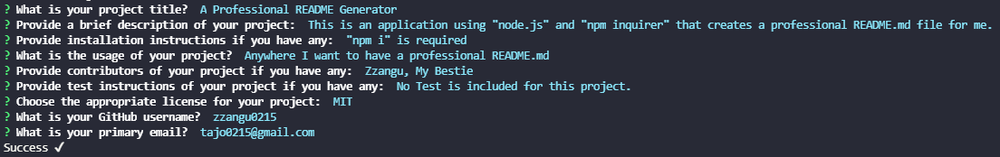
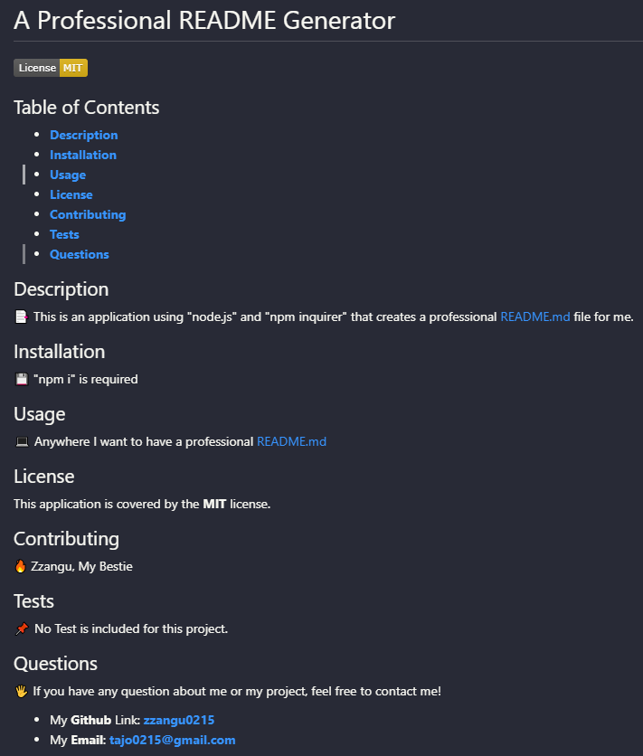

# Professional README Generator

Do you want to save your time on making README.md for your project?  
You should checkout my **Professional README Generator** to make your life easier!

## Features

You will be prompt to provide the basic information of your README file.
1. The **title** of your project.
2. A brief **description** of your project.
3. Any **installation** instruction if you have.
4. The **usage** of your project.
5. Any **contributor** if you have.
6. Any **test instruction** if you have.
7. What **license** is based of your project.
8. Your **GitHub** user name.
9. Your primary **email**.

**User Input Example**

Once you successfully provide all the information above, you will get a well-organized professional README file! All you need to do is just simply copy-pasting this file to your repository! Nice!

**Created README Based On the user input above**

## Demo Video

If you are unsure of what you need to do? Here is the link of the walkthrough video. Go check it out.  
[**Demo Video Link**](https://youtu.be/ymh6NgjPLL0)

## Author

- **Jun Park**
    - Portfolio: [**Portfolio**](https://zzangu0215.github.io/portfolio/) (to be updated)
    - Email: tajo0215@gmail.com
    - SNS: [**Instagram**](https://www.instagram.com/o0ojunny/)